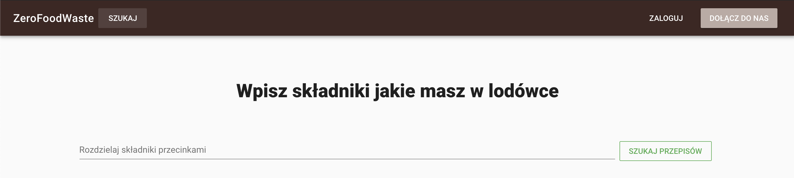
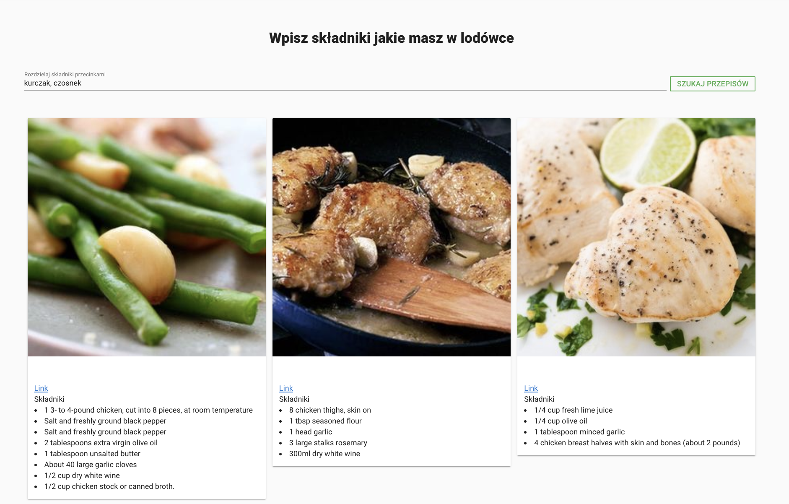
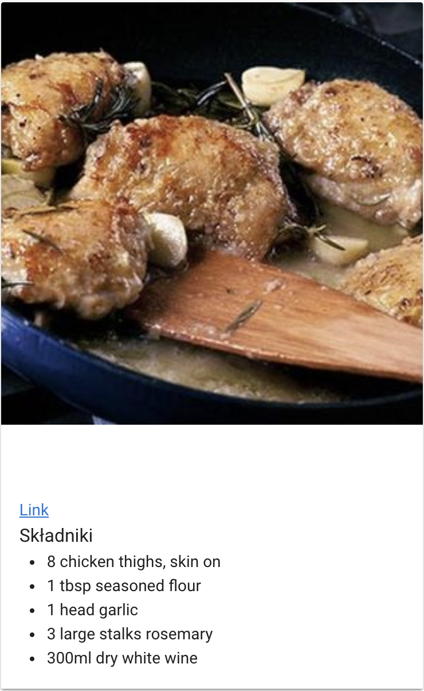
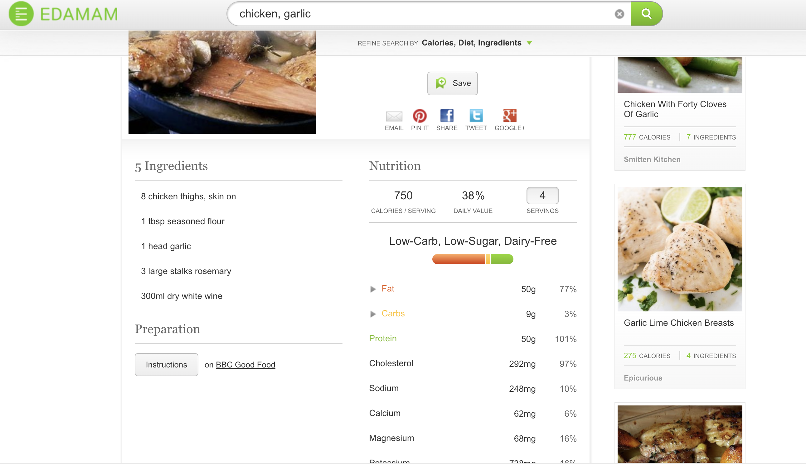

## Witaj na stronie produktu [ZeroFoodWaste](https://bai-studia.firebaseapp.com/)

Aplikacja na celu zmniejsze ilości wyrzucanych produktów, przez proponowanie przepisów z 
wykorzystaniem jak największej ilości ich. Wpisujemy nazwy składników (w dowolnym języku), które chcemy użyć,
 a apliakcja pokazuje zdjęcie potrawy, wszystkie składniki i przepis. Istnieje również możliwość stworzenia swojego konta.
 
[ZeroFoodWaste](https://bai-studia.firebaseapp.com/)
 

### Wykorzystane API

Aplikacja korzysta z dwóch API.


#### EDAMAM API


API po wysłaniu składników, które chcemy użyć zwraca dane dotyczące potraw - składniki, zdjęcie, link do przepisu, informacje o makro i microskładnikach.

```
https://developer.edamam.com/edamam-docs-recipe-api
```

### Cloud Translation API from Google

API tłumaczy nazwy wpisanych składników na język angielski, co pozwala na wysłanie zapytanie do api z potrawami.

```
https://cloud.google.com/translate/docs/reference/rest
```

### Prezentacja aplikacji








### Wykonali

- Kamil Drążkiewicz
- Piotr Kmita
- Daniel Wrona

### Linki do składowych projektu
- [Aplikacja](https://bai-studia.firebaseapp.com/)
- [Github project](https://github.com/piotrkmita/ZeroFoodWaste)
- [Edamam Api](https://developer.edamam.com/edamam-docs-recipe-api)
- [Cloud Translation API from Google](https://cloud.google.com/translate/docs/reference/rest)
